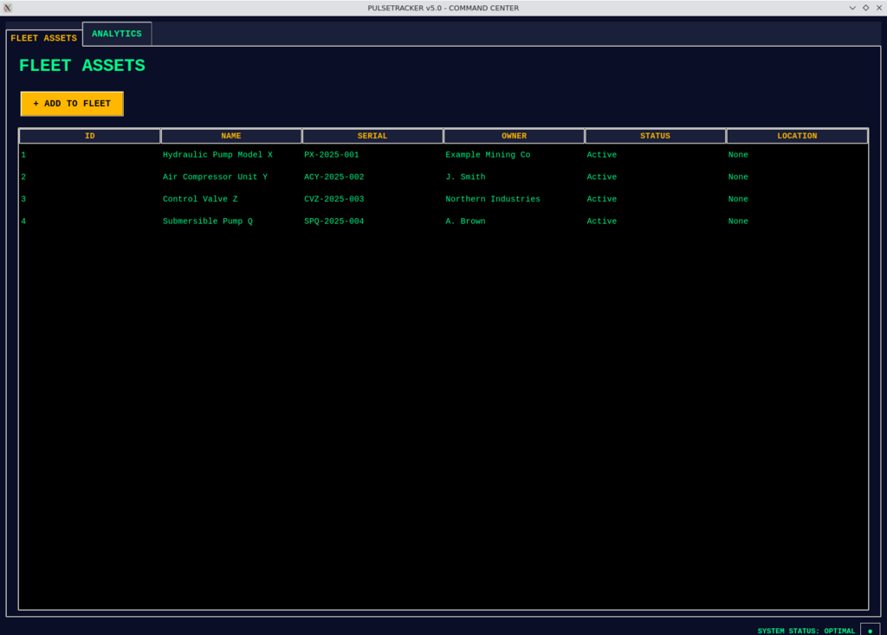
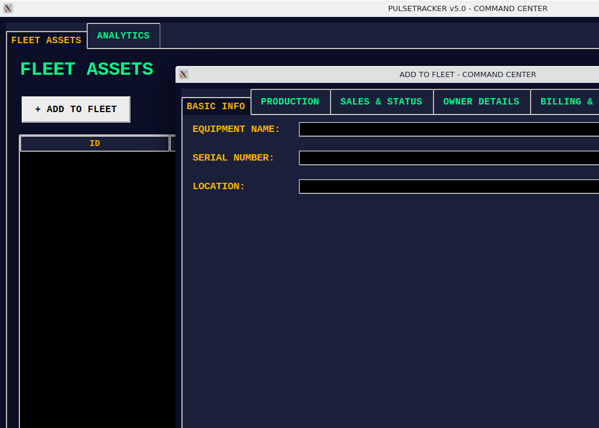
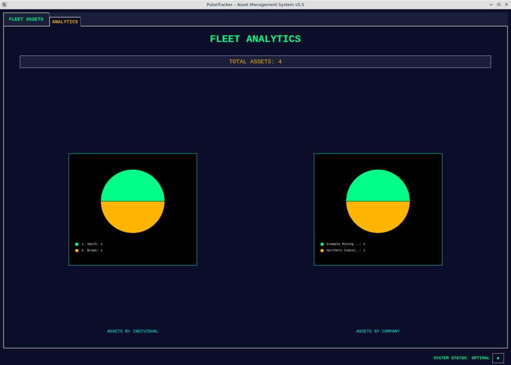
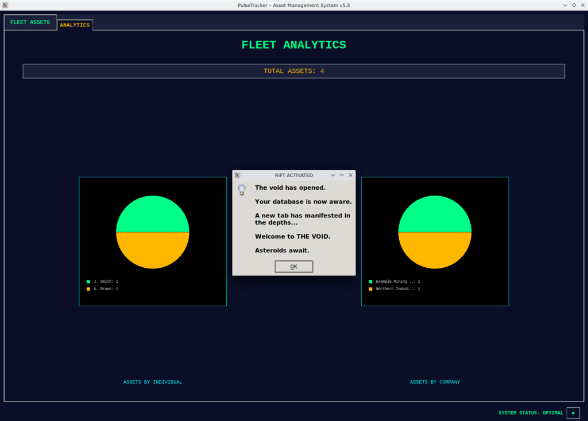
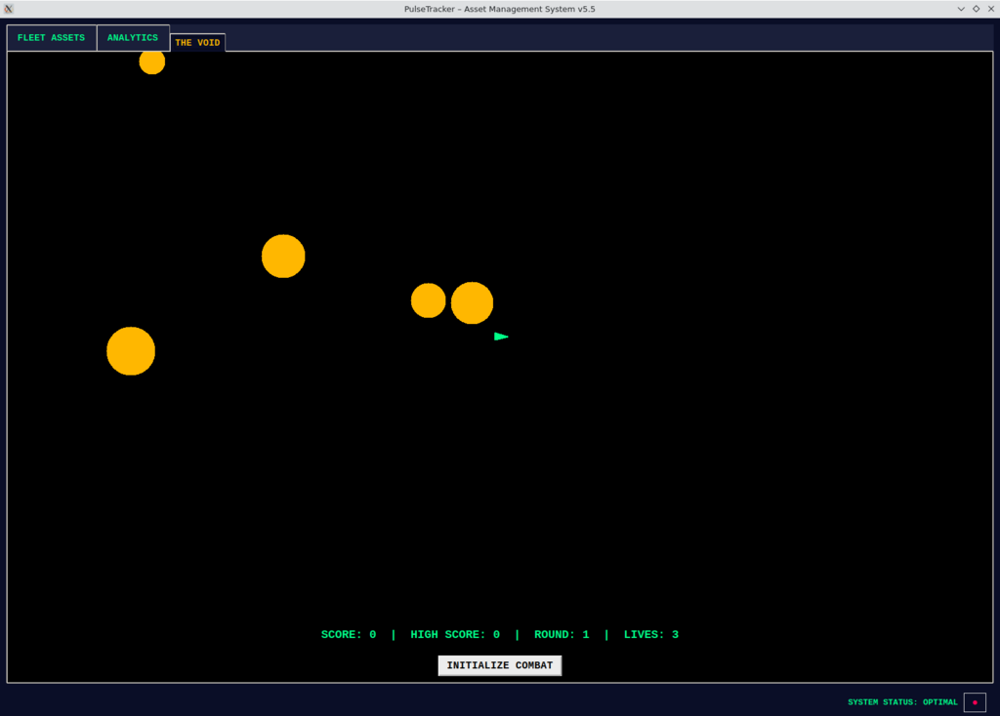

# PulseTracker v5.5 — Asset Management System 🚀

## What it does

**PulseTracker** manages hardware *after* it's sold — the full post-sale asset lifecycle plus the people and companies who own it. Add equipment to your "fleet" with production, sales, status and owner details, attach supporting files, then double-click any asset to see its complete history. An Analytics view breaks down ownership across individual and company owners with interactive pie charts. It's a single-file desktop app with a local database, built for a shared workshop/NAS setup (a single-instance lock stops two people writing at once). Presents a clean, professional interface by default, with a hidden "Dark Matter" alter-ego — a worn "Starship Command Center" theme and an easter egg or two — for the curious. Windows desktop app, built with Python/Tkinter.

## Screenshots

**Fleet Assets** — the main register of installed/sold hardware.



**Add to Fleet** — multi-section form (Basic Info · Production · Sales & Status · Owner Details · Billing & Shipping · Attachments).



**Analytics** — asset ownership broken down by individual and company owner.



### 🛸 Easter egg: THE VOID

Click the status dot in the bottom-right footer **three times** to trip the hidden "Dark Matter" trigger. The database "wakes up" and a secret tab appears:



...unlocking **THE VOID** — a fully playable Asteroids game tucked inside your asset tracker:



## Core Modules
- **Equipment (Field Assets)** — primary tab for tracking installed/sold assets with full lifecycle details.
- **Analytics** — visualise asset distribution by individual and company owners with interactive pie charts.

## Key Features

### Comprehensive Asset Tracking
- **"Add to Fleet" window** — a dedicated, multi-section form combining Basic Info, Production, Sales & Status, Owner Details, and Attachments.
- **Detailed asset view** — double-click any equipment in the main list to view its complete lifecycle, including all associated attachments.
- **Owner management** — separate fields for individual and company owners, each with dedicated notes.

### Analytics
- **Pie charts** — visual breakdown of asset ownership distribution to understand your fleet's reach.

### Single-instance lock
- A `pulse.lock` file prevents two workstations editing the shared database at the same time, with an option to force-unlock if needed.

## Tech
- **Python 3** + **Tkinter** (GUI)
- **Pillow**, **pandas**, **openpyxl**, **psutil**
- Local database via the bundled `database.py`

## Build & Run

From source:
```bash
pip install -r requirements.txt
python main.py
```

Standalone Windows executable:
1. Install dependencies (`pip install -r requirements.txt`).
2. Run `build.bat` to generate the executable with PyInstaller.
3. Launch `dist/PulseTracker.exe`.

See [`BUILD_GUIDE.md`](BUILD_GUIDE.md) for more detail.

## License
[The Unlicense](LICENSE) — released into the public domain. No copyright, do whatever you like with it.
